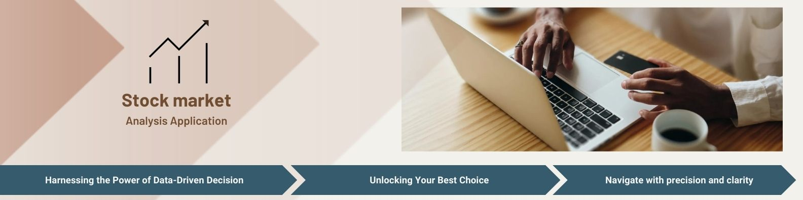

# Market Data Ingestion and BigQuery Integration


## Introduction
 Building upon the foundation of the original [Market Data Ingestion Project](https://github.com/data-modelisation/stock-market-ingesting),
 this enhanced version takes a leap forward by adopting the Infrastructure as Code paradigm.

 By utilizing Terraform, the project ensures consistent, repeatable and version-controlled infrastructure setups.
 
## Getting Started

### Prerequisites

Before you begin, make sure you have the following:

- Python 3.x installed
- Google Cloud Platform account with BigQuery access
- [API access credentials](https://www.alphavantage.co/support/#api-key)  for the market data source

### Installation

1. Clone this repository to your local machine:
   ```bash
   git clone https://github.com/your-username/market-data-ingesting-terraform.git
   ```
2. Navigate to the project directory:

    ```bash
    cd market-data-ingesting-terraform
    ```
3. Initialize all the environment variables 
    ```bash
    source gcp_project/init.sh
    ```
4. Init project :
    ```bash
    make init
    ```

5. Build project:
    ```bash
    make build
    ```
This command `init` init terraform and install requirements.
This command `build` create seamlessly GCP ressources through the execution of the `terraform apply` command. 
For a detailed view of the Terraform configuration refer to the `build` folder. 

For uninstallation of the project, execute the following command :
```bash
make cleanup
```
This command remove all the GCP resources through the execution of the `terraform destroy` command. 

### Usage

See [Market Data Ingestion Project](https://github.com/data-modelisation/stock-market-ingesting)


### Configuration

See [Market Data Ingestion Project](https://github.com/data-modelisation/stock-market-ingesting)


### Testing 

See [Market Data Ingestion Project](https://github.com/data-modelisation/stock-market-ingesting)

### Contributing
Contributions are welcome! If you have any ideas, improvements, or bug fixes, please feel free to open an issue or submit a pull request.

### License
This project is licensed under the MIT License.
